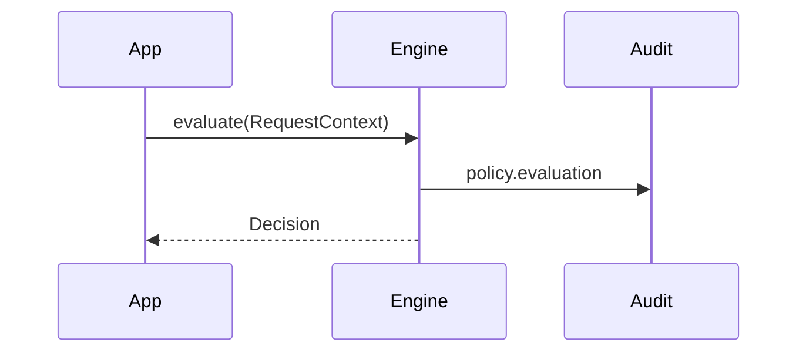

> **Version:** v1.1.0  
> This page documents behavior guaranteed in TealTiger v1.1.0.

# Evaluation Flow

## Notes

- Mode influences enforcement behavior.
- Decisions are deterministic for the same inputs.
