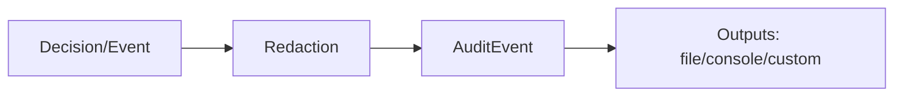

> **Version:** v1.1.0  
> This page documents behavior guaranteed in TealTiger v1.1.0.

# Logging Flow

```mermaid
flowchart LR
  A[Decision/Event] --> B[Redaction]
  B --> C[AuditEvent]
  C --> D[Outputs: file/console/custom]
```
