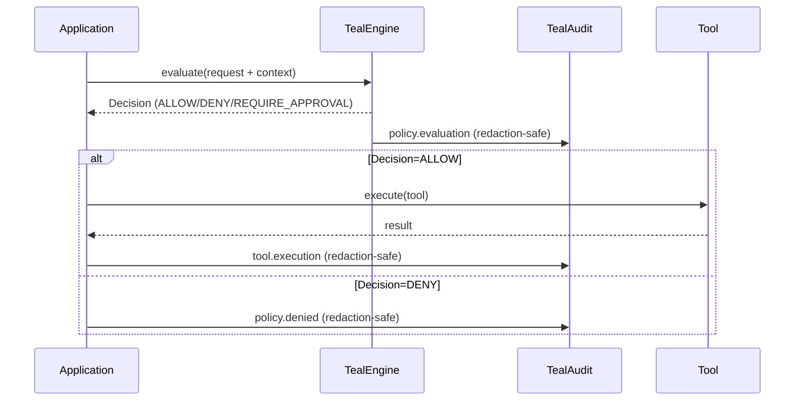

import { Callout, Steps } from "mintlify/components";
import { RequestExample, ResponseExample } from "mintlify/components";

> **Version:** v1.1.0  
> This Quickstart documents the **v1.1.0 contract** (requirements + design). Final API names may evolve, but the **flow and guarantees** described here are the target behavior.

# Quickstart (v1.1.0)

## What you’ll build

In 5–10 minutes, you’ll add TealTiger to an “agent-like” flow that:

- Blocks a dangerous tool (`file_delete`) in **ENFORCE**
- Allows a safe tool (`customer_data_read`)
- Emits **redaction-safe audit events** (no raw prompts/responses by default)
- Correlates everything using `correlation_id` (and optional `trace_id`)

✅ **Success criteria:** you see a deterministic `Decision` and an `AuditEvent` with the same `correlation_id`.

---

## Architecture (1-minute mental model)



<Callout type="info">
TealTiger v1.1.0 is **SDK-only**. You don’t need a server-side control plane to start enforcing policies and producing audit trails.
</Callout>

---

## Prerequisites

- Node.js (TypeScript) or Python runtime
- A place to write audit logs (console or file)

---

## Install

<RequestExample>
```bash title="Node.js"
npm install tealtiger
# or
pnpm add tealtiger
```

```bash title="Python"
pip install tealtiger
```
</RequestExample>

<ResponseExample>
```text title="Expected"
✅ Installation completed
```
</ResponseExample>

---

## Step-by-step integration

<Steps>
  <Steps.Step title="1) Create a safe default TealAudit (redaction-by-default)">
    Configure audit logging so logs are safe in production by default.

<RequestExample>
```ts title="TypeScript"
import { TealAudit, RedactionLevel, FileOutput } from "tealtiger";

export const audit = new TealAudit({
  outputs: [new FileOutput("./audit.log")],
  config: {
    input_redaction: RedactionLevel.HASH,
    output_redaction: RedactionLevel.HASH,
    detect_pii: true,
    debug_mode: false
  }
});
```

```py title="Python"
from tealtiger import TealAudit, RedactionLevel, FileOutput

audit = TealAudit({
  "outputs": [FileOutput("./audit.log")],
  "config": {
    "input_redaction": RedactionLevel.HASH,
    "output_redaction": RedactionLevel.HASH,
    "detect_pii": True,
    "debug_mode": False
  }
})
```
</RequestExample>

<ResponseExample>
```text title="Guarantee"
No raw prompts/responses are emitted by default; only redacted safe fields are logged.
```
</ResponseExample>

  </Steps.Step>

  <Steps.Step title="2) Configure TealEngine with rollout modes">
    Start safe: MONITOR globally, ENFORCE only the most critical policy first.

<RequestExample>
```ts title="TypeScript"
import { TealEngine, PolicyMode } from "tealtiger";

const policies = {
  tools: {
    file_delete: { allowed: false },
    customer_data_read: { allowed: true }
  }
};

export const engine = new TealEngine({
  policies,
  mode: {
    defaultMode: PolicyMode.MONITOR,
    policyModes: {
      "tools.file_delete": PolicyMode.ENFORCE
    }
  }
});
```

```py title="Python"
from tealtiger import TealEngine, PolicyMode

policies = {
  "tools": {
    "file_delete": {"allowed": False},
    "customer_data_read": {"allowed": True}
  }
}

engine = TealEngine({
  "policies": policies,
  "mode": {
    "defaultMode": PolicyMode.MONITOR,
    "policyModes": {
      "tools.file_delete": PolicyMode.ENFORCE
    }
  }
})
```
</RequestExample>

<ResponseExample>
```text title="Expected behavior"
- file_delete -> DENY (ENFORCE)
- other policies -> MONITOR (allow + log)
```
</ResponseExample>

  </Steps.Step>

  <Steps.Step title="3) Create ExecutionContext (correlation + traceability)">
    Use a context so every decision and audit event is traceable end-to-end.

<RequestExample>
```ts title="TypeScript"
import { ContextManager } from "tealtiger";

export const context = ContextManager.createContext({
  tenant_id: "acme-corp",
  app: "customer-support",
  env: "staging",
  agent_purpose: "ticket_resolution"
  // trace_id optional (OpenTelemetry)
});
```

```py title="Python"
from tealtiger import ContextManager

context = ContextManager.createContext({
  "tenant_id": "acme-corp",
  "app": "customer-support",
  "env": "staging",
  "agent_purpose": "ticket_resolution"
})
```
</RequestExample>

<ResponseExample>
```json title="Expected"
{ "correlation_id": "req-<uuid>" }
```
</ResponseExample>

  </Steps.Step>

  <Steps.Step title="4) Evaluate a tool request and handle the deterministic Decision">
    Evaluate the request before executing a tool. Handle the decision deterministically.

<RequestExample>
```ts title="TypeScript"
import { DecisionAction, ReasonCode } from "tealtiger";
import { engine } from "./engine";
import { audit } from "./audit";
import { context } from "./context";

const request = {
  agentId: "support-001",
  action: "tool.execute",
  tool: "file_delete",
  context
};

const decision = engine.evaluate(request);

// Emit an audit event (redaction-safe)
audit.log({
  schema_version: "1.0.0",
  event_type: "policy.evaluation",
  timestamp: new Date().toISOString(),
  correlation_id: decision.correlation_id,
  trace_id: decision.trace_id,
  policy_id: decision.policy_id,
  policy_version: decision.policy_version,
  mode: decision.mode,
  action: decision.action,
  reason_codes: decision.reason_codes,
  risk_score: decision.risk_score,
  metadata: {
    execution: {
      correlation_id: decision.correlation_id,
      trace_id: decision.trace_id
    }
  }
});

if (decision.action === DecisionAction.DENY) {
  if (decision.reason_codes.includes(ReasonCode.TOOL_NOT_ALLOWED)) {
    throw new Error("Tool not allowed by policy");
  }
}
```

```py title="Python"
from datetime import datetime
from tealtiger import DecisionAction, ReasonCode
from engine import engine
from audit import audit
from context import context

request = {
  "agentId": "support-001",
  "action": "tool.execute",
  "tool": "file_delete",
  "context": context
}

decision = engine.evaluate(request)

audit.log({
  "schema_version": "1.0.0",
  "event_type": "policy.evaluation",
  "timestamp": datetime.utcnow().isoformat() + "Z",
  "correlation_id": decision["correlation_id"],
  "trace_id": decision.get("trace_id"),
  "policy_id": decision["policy_id"],
  "policy_version": decision["policy_version"],
  "mode": decision["mode"],
  "action": decision["action"],
  "reason_codes": decision["reason_codes"],
  "risk_score": decision["risk_score"],
  "metadata": {
    "execution": {
      "correlation_id": decision["correlation_id"],
      "trace_id": decision.get("trace_id")
    }
  }
})

if decision["action"] == DecisionAction.DENY:
  if ReasonCode.TOOL_NOT_ALLOWED in decision["reason_codes"]:
    raise Exception("Tool not allowed by policy")
```
</RequestExample>

<ResponseExample>
```json title="Expected decision (example)"
{
  "action": "DENY",
  "reason_codes": ["TOOL_NOT_ALLOWED"],
  "risk_score": 95,
  "mode": "ENFORCE",
  "correlation_id": "req-<uuid>"
}
```
</ResponseExample>

  </Steps.Step>

  <Steps.Step title="5) Verify success">
    Confirm determinism and traceability.

    - You received a `Decision` with `action`, `reason_codes`, and `risk_score`.
    - Your audit output contains an event with the same `correlation_id`.
    - No raw prompts/responses appear in logs unless you explicitly enable debug mode.

  </Steps.Step>
</Steps>

---

## Optional: Record cost metadata

If you compute or receive cost information, store it under `metadata.cost.*`.

<RequestExample>
```json title="AuditEvent.metadata.cost (example)"
{
  "metadata": {
    "cost": {
      "estimated": 1.2,
      "actual": 1.0,
      "currency": "USD",
      "budget_scope": "request"
    }
  }
}
```
</RequestExample>

---

## Troubleshooting

### “I see missing pages / 404 for a page”
- Ensure `docs.json` navigation paths match `.mdx` file paths exactly (case-sensitive).

### “My logs contain sensitive content”
- Ensure `debug_mode` is `false` and redaction levels are `HASH` or stronger.
- Keep `detect_pii` enabled.

### “Everything is ALLOW even in ENFORCE”
- Confirm the policy is being evaluated for your `action/tool`.
- Ensure the effective mode is ENFORCE (policy override or default).

---

## Next steps

- Decision Model: `concepts/decision-model`
- Policy Modes: `concepts/policy-modes`
- Audit & Redaction: `concepts/audit-and-redaction`
- AuditEvent Schema: `audit/audit-event-schema`
