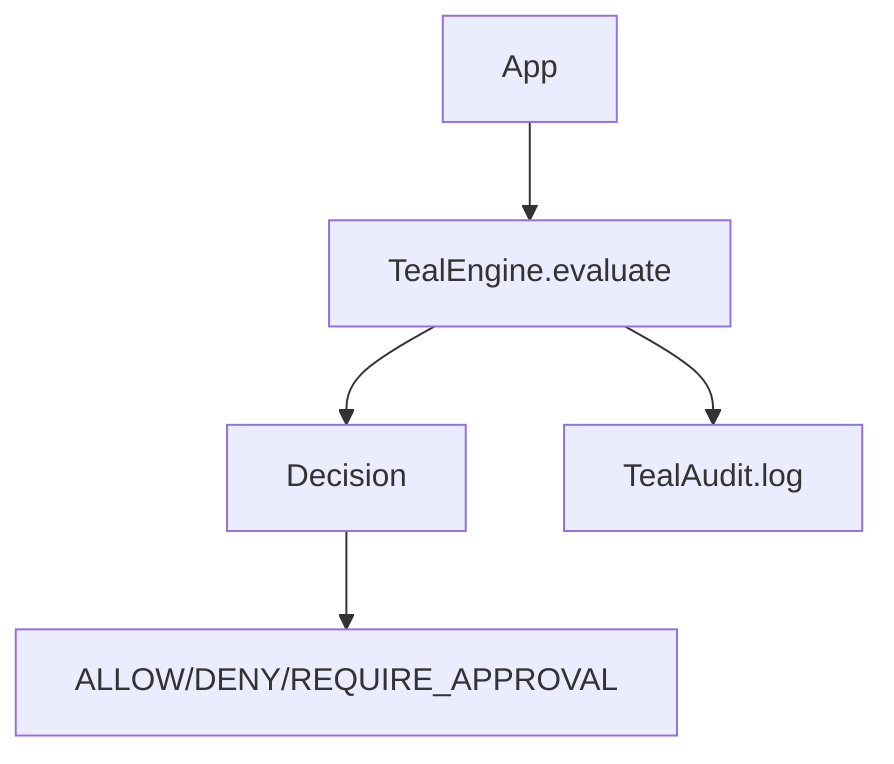

> **Version:** v1.1.0  
> This page documents behavior guaranteed in TealTiger v1.1.0.


# Quickstart (v1.1.0)

## Goal

Add **policy enforcement**, **deterministic decisions**, and **redaction-safe audit logs** to your application.

## Steps

1. Install the SDK (TypeScript / Python)
2. Configure `TealEngine` with rollout mode
3. Configure `TealAudit` with redaction defaults
4. Create `ExecutionContext` with `correlation_id`
5. Evaluate a request and handle the returned `Decision`

## Diagram (flow)



## Example (TypeScript)

```ts
// TODO: Replace with final SDK import paths once code is published.
// Demonstrates intended flow per v1.1.0 contract.

// 1) Create context
// 2) Evaluate request
// 3) Handle Decision
// 4) Emit AuditEvent
```

## Example (Python)

```py
# TODO: Replace with final SDK import paths once code is published.
# Demonstrates intended flow per v1.1.0 contract.
```

## Next

- Read **Decision Model** and **Policy Modes**
- Configure **Audit & Redaction** for production defaults
